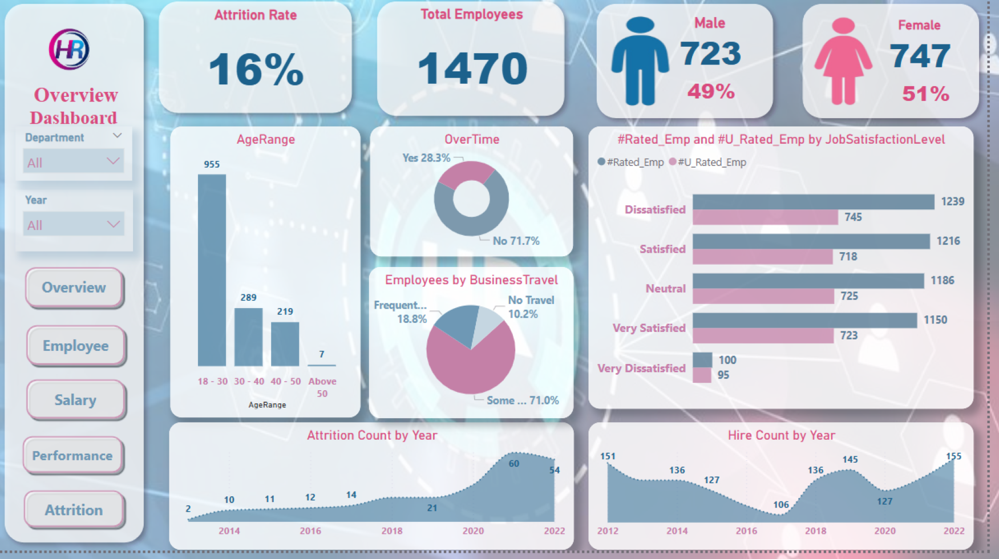

# 🧠 HR Analytics Dashboard with Python

Welcome to the **HR Analytics Dashboard Project**, where data meets insights! This project focuses on analyzing employee data to uncover key metrics related to performance, tenure, ratings, and much more—using Python, Jupyter Notebooks, and a sprinkle of data magic. ✨

---

## 📸 Dashboard Preview

> *(Insert a sleek screenshot of your dashboard below)*

> *Tip: Save your screenshot as `dashboard.png` and replace the file name above to show it off right here!*

---

## 📁 Project Files

- `HR_Python.ipynb` – The main Jupyter Notebook where all the analysis and visualizations happen.
- `data/` – *(Optional)* A folder where your HR dataset(s) reside.
- `README.md` – You’re reading it!

---

## 🔧 Tools & Technologies

- **Python**
- **Pandas** – For data wrangling.
- **Matplotlib / Seaborn / Plotly** – For visual magic.
- **Jupyter Notebook** – Because interactive coding is the vibe.
- **Power Query / Excel / Tableau** *(optional but complementary tools)*

---

## 🔍 Key Insights

Some potential questions this dashboard can answer:
- How does tenure correlate with manager ratings?
- What are the trends in employee performance over time?
- Are there patterns in attrition or promotion?

---

## 🏁 Getting Started

To run the notebook:
1. Clone this repo or download the files.
2. Open `HR_Python.ipynb` in Jupyter Lab/Notebook.
3. Run the cells step-by-step.
4. Voilà! Visuals, stats, and business insights roll out.

---

## 💡 Future Additions

- Tableau interactive dashboard (optional enhancement)
- KPI summaries and exportable reports
- Predictive modeling on attrition or performance

---

## 🤝 Credits

Built by Shaimaa Muhammad Hassan — turning HR data into poetry 📊🎶

---

## 📬 Contact

📧 engshimo77@gmail.com  
🔗 [LinkedIn](https://www.linkedin.com/in/shaimaa-hassan-63065331b)

---

> *“Numbers don’t lie. But they do need someone to speak their truth.”*

